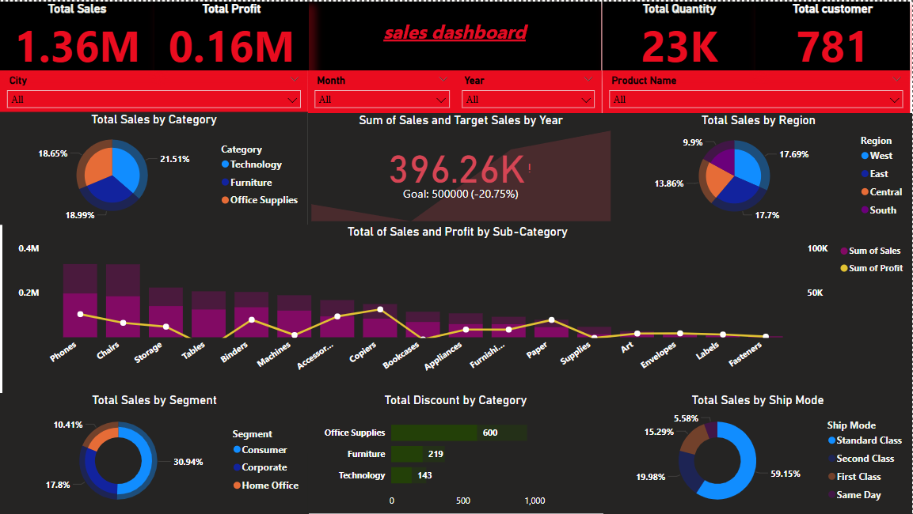

# Sales Overview Dashboard - Power BI

##  Overview
This project features a comprehensive **Sales Overview Dashboard** built using Power BI. The dashboard analyzes key business metrics including total sales, profit, discount distribution, customer count, and product performance across various categories and regions. Interactive slicers enable dynamic data exploration to support business decision-making.

---

## Key Insights
-  **Sales Performance:** Achieved $1.36M in total sales with $160K in profit.
-  **Customer Base:** Served 781 customers with a total quantity sold of 23K units.
-  **Category Analysis:** Technology leads in sales contribution, followed by Office Supplies and Furniture.
-  **Regional Trends:** East and South regions show similar strong sales percentages.
-  **Shipping Insights:** Standard Class dominates shipping with nearly 60% of total sales.

---

##  Dashboard Features
-  **Interactive Filters** by City, Month, Year, and Product Name.
-  **Line & Bar Charts** showing sales vs profit by sub-category.
-  **Donut Charts** for breakdowns by Region, Segment, Ship Mode, and Category.
-  **Target Tracking** comparing actual sales against set goals.
-  **Discount Analysis** to examine discount patterns across categories.

---

##  Files Included
- `Sales Overview Data.csv` – Raw sales dataset used for building the dashboard.
- `SalesOverviewDashboard.pbix` – Power BI dashboard file *(Add link after upload)*.
- `images/sales-dashboard-preview.png` – Snapshot of the dashboard for quick preview.

---

##  Dashboard Preview

---

##  Tools Used
- **Power BI:** For data visualization and interactive dashboard creation.
- **Power Query:** For data cleaning, transformation, and preparation.
- **Microsoft Excel (.csv):** Source of raw sales data.

---

###  Author  
**Insiya**  
_Data Science Student | Power BI Enthusiast | Passionate about transforming data into actionable insights_

---

 *If you found this project insightful, don’t forget to star this repository!*

